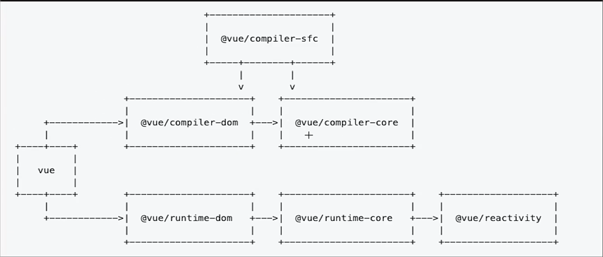
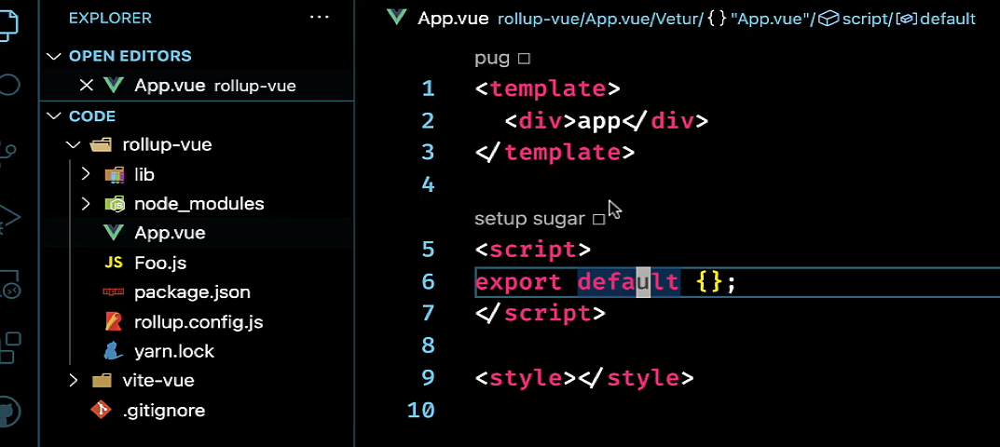
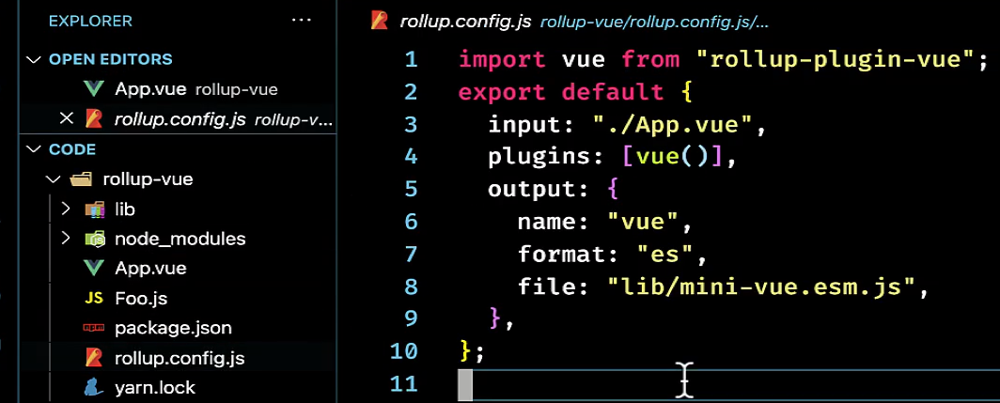
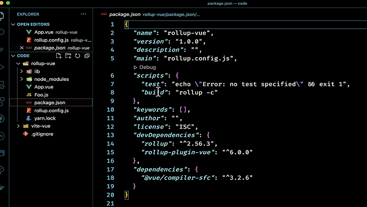
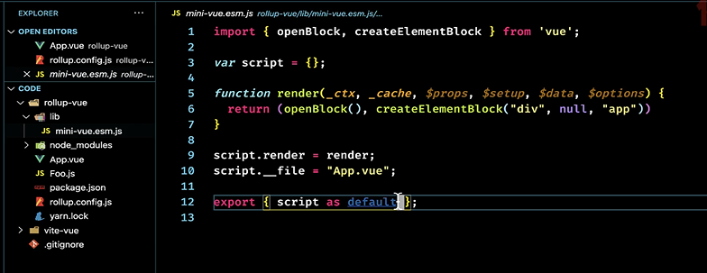

## 1. 介绍

+ 上图vue3模块的组织方式和结构

+ 我们只需要导入vue的模块就可以使用，vue模块是所用功能统一的出口

+ 上半部分三个模块处理编译，`compliler` 编译器

+ 下半部分三个模块处理运行时，`runtime` 运行器

+ 编译时：

  + `compliler-sfc`: 处理sfc单文件组件（.vue文件），转成浏览器能读的js文件。里面依赖了`compliler-dom`和`compliler-core`

  + `compliler-dom`: 底层依赖`compliler-core`，处理单文件组件中的`<template>XXX</template>`变成一个render函数

+ 运行时:

  + `runtime-dom`: 专门处理dom上节点的东西，依赖`runtime-core`核心，引入了`runtime-core`,并导出
  + `runtime-core`: 运行时核心源码，依赖`reactivity`
  + `reactivity`: 实现了响应式

+ 能够发现`vue`模块依赖的上面6个模块，并且作为了统一的导出出口

+ 这几个模块都是可以单独使用。

## 2. compliler-sfc

1. 一个vue单文件

2. 通过rollup打包功能，同时借助rollup-plugin-vue插件将vue文件打包成js文件，插件里使用到了`compliler-sfc`

3. 执行打包

4. 生成文件

+ 虚拟节点通过h函数实现

