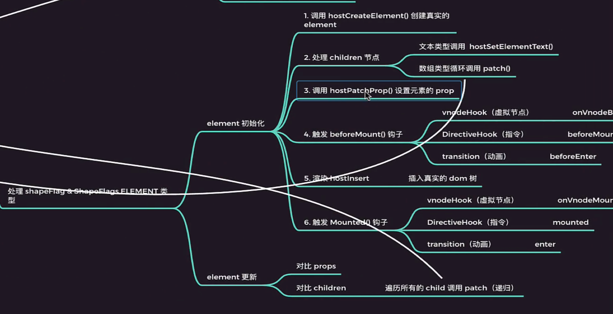

## 初始化过程

当我们第一次运行代码实现一个Hellow world的时候，vue会做些什么？

1. createApp函数中，会先创建一个app对象

```js
import { createVNode } from "./vnode";

// createApp(App).mount("#root");
export function createAppAPI(render) {
  
  return function createApp(rootComponent) {
    const app = {
      _component: rootComponent,
      mount(rootContainer) {
          
        console.log("基于根组件创建 vnode");
        // 1. 根据传入的rootComponent创建虚拟节点
        // rootComponent在这里是我们的根节点
        // 生成的vnode节点中有一个对象type，里面包含了传入的App的信息
        const vnode = createVNode(rootComponent);
          
        console.log("调用 render，基于 vnode 进行开箱");
        // 2. 进行render,render函数调用了patch方法
        render(vnode, rootContainer);
      },
    };

    // 3. 导出的app就会有关键的mount方法
    return app;
  };
}

```

2. 执行render函数，内部调用了patch方法，

3. patch函数中，基于vnode的类型进行不同类型的组件处理。

   patch根据传入的类型进行不同的处理，component类型会进行processCompoent处理成element类型

   element类型的时候就进行processElement

```js
// 解构出type
const { type, shapeFlag } = n2;

// 根据type类型进行不同的处理
switch (type) {
 
 // shapeFlags基于二进制做的处理，通过二进制的方式获取到他的类型，以此区分不同的组件
    
    // 第一次初始化的时候，类型是component类型会进入到初始化组件的方法processComponent
}
```

4. 初始化组件processComponent

```ts
// n1表示之前，n2表示当前的值，用于更新比较
function processComponent(n1, n2, container, parentComponent) {
  // n1没有值的话，走初始化mountComponent
	if (!n1) {
    mountComponent(n2, container, parentComponent);
  }
  else {
    updateComponent(n1, n2);
  }
}
```

4. mountComponent

```ts
function mountComponent(initialVNode, container, parentComponent) {
  	// 1. 创建一个component instance对象
    const instance = (initialVNode.component = createComponentInstance(initialVNode, parentComponent));
    console.log(`创建组件实例:${instance.type.name}`);
  	// 2. setup
    setupComponent(instance);
    setupRenderEffect(instance, initialVNode, container);
}
```

5. setupComponent执行，这一步可以理解为初始化数据，确保后续执行的时候存在该数据和方法
   1. 初始化props
   2. 初始化slots
   3. 调用setup()，返回一个对象或者函数
   4. 设置render()函数

```ts
export function setupComponent(instance) {
  // 1. 处理 props
  // 取出存在 vnode 里面的 props
  const { props, children } = instance.vnode;
  initProps(instance, props);
  // 2. 处理 slots
  initSlots(instance, children);

  // 源码里面有两种类型的 component
  // 一种是基于 options 创建的
  // 还有一种是 function 的
  // 这里处理的是 options 创建的
  // 叫做 stateful 类型
  setupStatefulComponent(instance);
}
```

5. setupStatefulComponent

```ts
function setupStatefulComponent(instance) {
    console.log("创建 proxy");
  	// 1. 创建proxy
  	// 2. instance的作用就是搜集数据，为后续算法做准备	
    instance.proxy = new Proxy(instance.ctx, PublicInstanceProxyHandlers);
  	// type保存的就是我们当前的组件信息
    const Component = instance.type;
  	// 组件信息中setup函数
    const { setup } = Component;
    if (setup) {
      	// 设置当前组件实例对象
        setCurrentInstance(instance);
      	// 我们使用setup api的时候，会得到两个参数，一个props，一个context
      	// 得到的context就是来自setupContext
        const setupContext = createSetupContext(instance);
      	
      	// 传入props和setup拿到返回值
        const setupResult = setup && setup(shallowReadonly(instance.props), setupContext);
        setCurrentInstance(null);
      	
      	// 对setup的值进行一定的处理 
        handleSetupResult(instance, setupResult);
    }
    else {
        finishComponentSetup(instance);
    }
}
```

7. handleSetupResult对setup返回结果进行处理，setup中返回一个函数，相当于我们的render函数

```ts
function handleSetupResult(instance, setupResult) {
  // setup 返回值不一样的话，会有不同的处理
  // 1. 看看 setupResult 是个什么
  // setup返回一个函数，相当于render函数
  if (typeof setupResult === "function") {
    // 如果返回的是 function 的话，那么绑定到 render 上
    // 认为是 render 逻辑
    // setup(){ return ()=>(h("div")) }
    instance.render = setupResult; 
  } else if (typeof setupResult === "object") {
    // 返回的是一个对象的话
    // 先存到 setupState 上
    // 先使用 @vue/reactivity 里面的 proxyRefs
    // 后面我们自己构建
    // proxyRefs 的作用就是把 setupResult 对象做一层代理
    // 方便用户直接访问 ref 类型的值
    // 比如 setupResult 里面有个 count 是个 ref 类型的对象，用户使用的时候就可以直接使用 count 了，而不需要在 count.value
    // 这里也就是官网里面说到的自动结构 Ref 类型
    instance.setupState = proxyRefs(setupResult);
  }

  finishComponentSetup(instance);
}

function finishComponentSetup(instance) {
  // 给 instance 设置 render

  // 先取到用户设置的 component options
  const Component = instance.type;
	
  // 检测有没有render函数，如果没有就把
  if (!instance.render) {
    // 如果 compile 有值 并且当组件没有 render 函数，那么就需要把 template 编译成 render 函数
    if (compile && !Component.render) {
      if (Component.template) {
        // 这里就是 runtime 模块和 compile 模块结合点
        const template = Component.template;
  
        Component.render = compile(template);
      }
    }

    // 如果setup没有给到一个返回的函数作为render，那么就会使用我们定义的组件上的render函数，从而获取虚拟节点vnode
    instance.render = Component.render;
  }

  // applyOptions()
}
```

8. finishComponentSetup执行完成后回到依次回到原来的函数，路径如下，最终回到了mountComponent中，继续执行下一行代码，即`setupRenderEffect(instance, initialVNode, container);`

```txt
finishComponentSetup -> handleSetupResult -> setupStatefulComponent -> setupComponent -> mountComponent
```

9. setupRenderEffect

   1. 调用render()函数获取获取vnode(自组件)
   2. 触发生命周期函数beforeMount hook
   3. 调用patch 初始化子组件(递归)
   4. 触发生命周期 mounted hook

   在componentUpdateFn获取到了虚拟节点，之后重新处理虚拟节点，调用patch函数

```js
  function setupRenderEffect(instance, initialVNode, container) {
    // 调用 render
    // 应该传入 ctx 也就是 proxy
    // ctx 可以选择暴露给用户的 api
    // 源代码里面是调用的 renderComponentRoot 函数
    // 这里为了简化直接调用 render

    // obj.name  = "111"
    // obj.name = "2222"
    // 从哪里做一些事
    // 收集数据改变之后要做的事 (函数)
    // 依赖收集   effect 函数
    // 触发依赖
    
    // 定义和componentUpdateFn函数
    function componentUpdateFn() {
      // isMounted标志初始化过没有
      if (!instance.isMounted) {
        // 组件初始化的时候会执行这里
        // 为什么要在这里调用 render 函数呢
        // 是因为在 effect 内调用 render 才能触发依赖收集
        // 等到后面响应式的值变更后会再次触发这个函数
        console.log(`${instance.type.name}:调用 render,获取 subTree`);
        const proxyToUse = instance.proxy;
        // 可在 render 函数中通过 this 来使用 proxy  
        const subTree = (instance.subTree = normalizeVNode(
          // 调用render函数，会返回虚拟节点
          instance.render.call(proxyToUse, proxyToUse)
        ));
        
        // 得到了虚拟节点，render函数执行了h函数，h函数生产虚拟节点
        console.log("subTree", subTree);

        // todo
        console.log(`${instance.type.name}:触发 beforeMount hook`);
        console.log(`${instance.type.name}:触发 onVnodeBeforeMount hook`);

        // 这里基于 subTree 再次调用 patch
        // 基于 render 返回的 vnode ，再次进行渲染
        // 这里我把这个行为隐喻成开箱
        // 一个组件就是一个箱子
        // 里面有可能是 element （也就是可以直接渲染的）
        // 也有可能还是 component
        // 这里就是递归的开箱
        // 而 subTree 就是当前的这个箱子（组件）装的东西
        // 箱子（组件）只是个概念，它实际是不需要渲染的
        // 要渲染的是箱子里面的 subTree
        patch(null, subTree, container, null, instance);
        // 把 root element 赋值给 组件的vnode.el ，为后续调用 $el 的时候获取值
        initialVNode.el = subTree.el;

        console.log(`${instance.type.name}:触发 mounted hook`);
        instance.isMounted = true;
      } else {
        // 响应式的值变更后会从这里执行逻辑
        // 主要就是拿到新的 vnode ，然后和之前的 vnode 进行对比
        console.log(`${instance.type.name}:调用更新逻辑`);
        // 拿到最新的 subTree
        const { next, vnode } = instance;

        // 如果有 next 的话， 说明需要更新组件的数据（props，slots 等）
        // 先更新组件的数据，然后更新完成后，在继续对比当前组件的子元素
        if (next) {
          // 问题是 next 和 vnode 的区别是什么
          next.el = vnode.el;
          updateComponentPreRender(instance, next);
        }

        const proxyToUse = instance.proxy;
        const nextTree = normalizeVNode(
          instance.render.call(proxyToUse, proxyToUse)
        );
        // 替换之前的 subTree
        const prevTree = instance.subTree;
        instance.subTree = nextTree;

        // 触发 beforeUpdated hook
        console.log(`${instance.type.name}:触发 beforeUpdated hook`);
        console.log(`${instance.type.name}:触发 onVnodeBeforeUpdate hook`);

        // 用旧的 vnode 和新的 vnode 交给 patch 来处理
        patch(prevTree, nextTree, prevTree.el, null, instance);

        // 触发 updated hook
        console.log(`${instance.type.name}:触发 updated hook`);
        console.log(`${instance.type.name}:触发 onVnodeUpdated hook`);
      }
    }

    // 在 vue3.2 版本里面是使用的 new ReactiveEffect
    // 至于为什么不直接用 effect ，是因为需要一个 scope  参数来收集所有的 effect
    // 而 effect 这个函数是对外的 api ，是不可以轻易改变参数的，所以会使用  new ReactiveEffect
    // 因为 ReactiveEffect 是内部对象，加一个参数是无所谓的
    // 后面如果要实现 scope 的逻辑的时候 需要改过来
    // 现在就先算了
    
    // effect传入函数componentUpdateFn的时候会执行一下
    instance.update = effect(componentUpdateFn, {
      scheduler: () => {
        // 把 effect 推到微任务的时候在执行
        // queueJob(effect);
        queueJob(instance.update);
      },
    });
  }
```

10. 回到patch函数之后，此时传入的类型就是element类型，调用processElement，对element初始化



```js
function processElement(n1, n2, container, anchor, parentComponent) {
  // 第一次n1肯定没有值，还没有完成挂载
  if (!n1) {
      mountElement(n2, container, anchor);
    } else {
      // todo
      updateElement(n1, n2, container, anchor, parentComponent);
    }
  }
```

11. mountElement虚拟节点转成真实DOM元素，利用runtime-dom里面的hostCreateElement,hostCreateElement使用的是document.createElement

```js
  function mountElement(vnode, container, anchor) {
    const { shapeFlag, props } = vnode;
    // 1. 先创建 element
    // 基于可扩展的渲染 api
    const el = (vnode.el = hostCreateElement(vnode.type));

    // 支持单子组件和多子组件的创建
    if (shapeFlag & ShapeFlags.TEXT_CHILDREN) {
      // 举个栗子
      // render(){
      //     return h("div",{},"test")
      // }
      // 这里 children 就是 test ，只需要渲染一下就完事了
      console.log(`处理文本:${vnode.children}`);
      hostSetElementText(el, vnode.children);
    } else if (shapeFlag & ShapeFlags.ARRAY_CHILDREN) {
      // 举个栗子
      // render(){
      // Hello 是个 component
      //     return h("div",{},[h("p"),h(Hello)])
      // }
      // 这里 children 就是个数组了，就需要依次调用 patch 递归来处理
      mountChildren(vnode.children, el);
    }

    // 处理 props
    if (props) {
      for (const key in props) {
        // todo
        // 需要过滤掉vue自身用的key
        // 比如生命周期相关的 key: beforeMount、mounted
        const nextVal = props[key];
        hostPatchProp(el, key, null, nextVal);
      }
    }

    // todo
    // 触发 beforeMount() 钩子
    console.log("vnodeHook  -> onVnodeBeforeMount");
    console.log("DirectiveHook  -> beforeMount");
    console.log("transition  -> beforeEnter");

    // 插入
    hostInsert(el, container, anchor);

    // todo
    // 触发 mounted() 钩子
    console.log("vnodeHook  -> onVnodeMounted");
    console.log("DirectiveHook  -> mounted");
    console.log("transition  -> enter");
  }
```

```ts
function createElement(type) {
  console.log("CreateElement", type);
  // 这里可以根据自己的需要换成生产canvas的api，这里我们做的是生产DOM
  const element = document.createElement(type);
  return element;
}
```

12. 创建真实的element之后，检查是否有children（数组类型，里面包含了多个字节点），递归children进行patch。

```js
function mountChildren(children, container) {
    children.forEach((VNodeChild) => {
      // todo
      // 这里应该需要处理一下 vnodeChild
      // 因为有可能不是 vnode 类型
      console.log("mountChildren:", VNodeChild);
      patch(null, VNodeChild, container);
    });
  }
```

13. 遍历props，调用hsotPatchProp，内部用的也是原生api，`el.setAttribute`等
14. 最终添加到我们的根元素

```js
 hostInsert(el, container, anchor);
```

## 总结

找到虚拟节点会进行patch，不断递归patch，从component，变成element，text，最终放回真实的element

所有虚拟节点走向patch，进行判断，然后调用不用的函数，文本hostSetElementText，最终用原生的`el.innerText`

我们开发的过程，即写组件，对于vue来说相当于一个箱子，里面有很多element的元素或者其他组件，我们需要把它渲染到浏览器上，整个初始化的过程，就是遇到组件进行render，不断拆开箱子，递归调用patch得到最终的基本元素element，最终渲染出来。

## 技巧

看源码的时候尽量看自己关注的主流程，其他流程可以猜测或略过